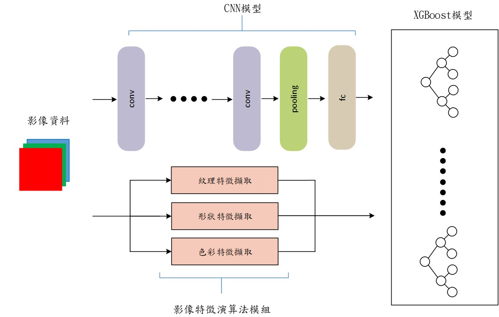
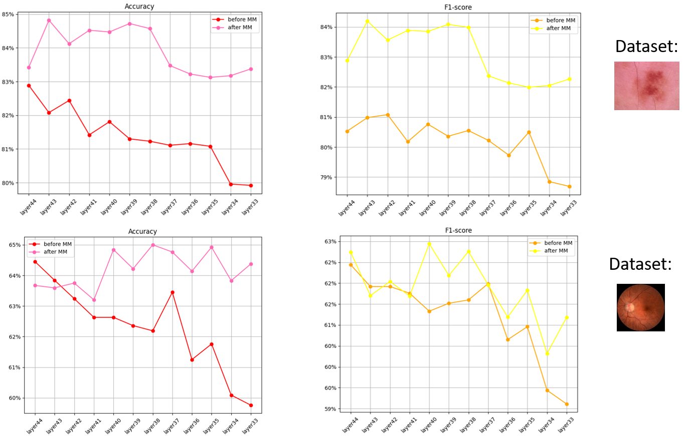

This project focuses on how to find optimized results between the efficiency and performance of the CNN-XGB model

# Intorduction
如下圖所示，本專案主要研究的方式是將CNN-XGB模型中CNN的部分進行剪枝，並使用傳統影像演算法算出影像的特徵，透過多模態的方式讓整體模型的性能不會下降太多

# Usage 

1. 從 Kaggle 下載數據集，將相關數據集解壓縮到 ./data 資料夾中  
[皮膚癌數據集 (HAM10000)](https://www.kaggle.com/datasets/surajghuwalewala/ham1000-segmentation-and-classification)  
[眼病數據集](https://www.kaggle.com/datasets/andrewmvd/ocular-disease-recognition-odir5k)

2. 使用 program/conv.ipynb 訓練 CNN 模型

3. 使用 program/deepXGB.ipynb 訓練 CNN-XGB 模型

### XGBoost模型的硬體化
1. 使用 program/XGB_on_FPGA.ipynb產生硬體化後XGBoost模型

2. 將src和步驟1產生的硬體模型放入EDA工具（Vivado 或 Intel Quartus皆可）的資源函式庫中

3. 實現硬體的模擬與實作

## 部分實驗結果
在vgg結合XGBoost的多模態實驗中，使用多模態後的混合模型能有較好的辨識率與F1-score，讓模型能在使用較低資源的設計下一樣能夠保有原本模型的性能  

# file dir

.  
├── data  // dataset folders  
├── hardwareSrc  // hardware resources  
│   ├── sim  // XGB hardware models  
│   └── src  // multiple decision trees hardware accelerator  
├── model  // models classified by dataset & whether multimodal is used  
├── program  
│   ├── conv.ipynb  // training CNN model  
│   ├── deepXGB.ipynb  // CNN-XGB training  
│   ├── DMNN_by_xgboost.ipynb  // algorithm using image features alone with XGB  
│   ├── helperFunction  // custom library  
│   ├── other_program  // unused historical files  
│   ├── plot_MM_results.py  // plot multimodal experiment results  
│   ├── plot_XGB_results.py  // plot deep pruning experiment results  
│   ├── XGB_on_FPGA.ipynb  // create XGB hardware model using XGB hardware tool  
│   ├── xgb_to_vhdl  // XGB to hardware tool  
└── results  // experiment results

# Reference
1. [XGB hardware realization tool](github.com/moomtp/XGBoost_tree_on_VHDL.git)   
2. other CNN-XGB relative reaseach, see detail on ./reference.txt
